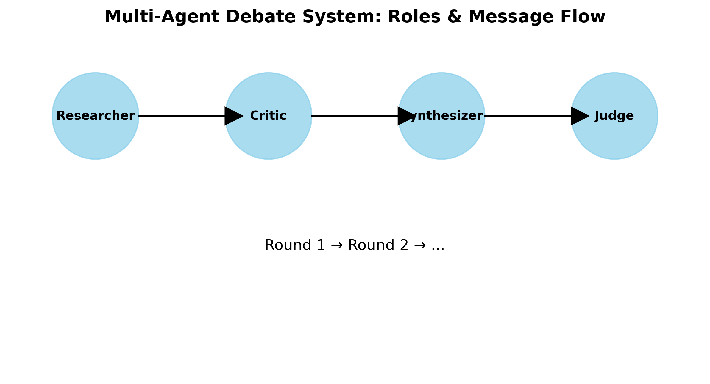

# Multi-Agent Debate System: Proof of Execution

## System Architecture

## Configuration Summary

| Parameter | Value |
|-----------|-------|
| Model | GLM-4.6 |
| Base URL | https://api.z.ai/api/coding/paas/v4/ |
| Default Temperature | 0.7 |
| Low Temperature | 0.2 |
| High Temperature | 0.9 |
| Default Rounds | 2 |
| Default Agents | 4 |
| Max Tokens | 1000 |

## Experiment Results

Topic: Should artificial intelligence be regulated to ensure ethical development?

### 2_agents

Description: Debate with 2 agents (Researcher, Judge)

Configuration: {'rounds': 2, 'agents': ['researcher', 'judge'], 'temperature': 0.7, 'include_devils_advocate': False}

Overall Score: 4.5/5.0

Convergence: Yes

Latency: 86.3 seconds

#### Sample Messages:

**Researcher (Round 1):**

### **Research Analysis: The Regulation of Artificial Intelligence for Ethical Development**

This analysis provides a factual foundation for the debate on whether artificial intelligence (AI) should...

**Researcher (Round 1):**

### **Research Analysis: The Regulation of Artificial Intelligence for Ethical Development**

This analysis provides a factual foundation for the debate on whether artificial intelligence (AI) should...

#### Final Verdict:

### **Judge's Evaluation and Verdict on the Regulation of Artificial Intelligence**

This evaluation is based on the comprehensive research analysis provided, which serves as the foundational brief for this structured debate.

---

#### **1. Overall Quality and Coherence of the Debate**

The debate...

---

### 4_agents

Description: Debate with 4 agents (Researcher, Critic, Synthesizer, Judge)

Configuration: {'rounds': 2, 'agents': ['researcher', 'critic', 'synthesizer', 'judge'], 'temperature': 0.7, 'include_devils_advocate': False}

Overall Score: 4.5/5.0

Convergence: Yes

Latency: 157.9 seconds

#### Sample Messages:

**Researcher (Round 1):**

### **Research Analysis: The Regulation of Artificial Intelligence for Ethical Development**

As a Researcher in this structured debate, my objective is to provide a comprehensive, evidence-based ana...

**Researcher (Round 1):**

### **Research Analysis: The Regulation of Artificial Intelligence for Ethical Development**

As a Researcher in this structured debate, my objective is to provide a comprehensive, evidence-based ana...

#### Final Verdict:

### **Judicial Evaluation of the Debate on AI Regulation**

As the Judge for this structured debate, I have reviewed the complete history of the arguments, from the initial research analysis to the final synthesis. The following is my comprehensive evaluation.

---

### **1. Overall Quality and Coh...

---

### 1_round

Description: Debate with 1 round

Configuration: {'rounds': 1, 'agents': ['researcher', 'critic', 'synthesizer', 'judge'], 'temperature': 0.7, 'include_devils_advocate': False}

Overall Score: 4.5/5.0

Convergence: Yes

Latency: 72.9 seconds

#### Sample Messages:

**Researcher (Round 1):**

### Research Analysis: The Regulation of Artificial Intelligence for Ethical Development

This analysis provides a factual foundation for the debate on whether artificial intelligence (AI) should be ...

**Researcher (Round 1):**

### Research Analysis: The Regulation of Artificial Intelligence for Ethical Development

This analysis provides a factual foundation for the debate on whether artificial intelligence (AI) should be ...

#### Final Verdict:

### Judge's Evaluation and Final Verdict

This evaluation assesses the structured debate on the regulation of artificial intelligence (AI) for ethical development, based on the provided research analysis.

---

#### 1. Overall Assessment of Argument Quality and Coherence

The overall quality of the...

---

### 3_rounds

Description: Debate with 3 rounds

Configuration: {'rounds': 3, 'agents': ['researcher', 'critic', 'synthesizer', 'judge'], 'temperature': 0.7, 'include_devils_advocate': False}

Overall Score: 5.0/5.0

Convergence: Yes

Latency: 132.4 seconds

#### Sample Messages:

**Researcher (Round 1):**

### Research Analysis: The Regulation of Artificial Intelligence for Ethical Development

This analysis provides a factual, evidence-based overview of the debate surrounding the regulation of artific...

**Researcher (Round 1):**

### Research Analysis: The Regulation of Artificial Intelligence for Ethical Development

This analysis provides a factual, evidence-based overview of the debate surrounding the regulation of artific...

#### Final Verdict:

### **Judicial Evaluation of the Debate on AI Regulation**

This evaluation assesses the structured debate on the regulation of artificial intelligence, based on the provided research analysis and final synthesis.

---

#### **1. Overall Quality and Coherence of the Debate**

The overall quality of...

---

### without_devils_advocate

Description: Debate without Devil's Advocate

Configuration: {'rounds': 2, 'agents': ['researcher', 'critic', 'synthesizer', 'judge'], 'temperature': 0.7, 'include_devils_advocate': False}

Overall Score: 4.8/5.0

Convergence: Yes

Latency: 159.4 seconds

#### Sample Messages:

**Researcher (Round 1):**

### **Research Analysis: The Regulation of Artificial Intelligence for Ethical Development**

This analysis provides a factual foundation for the debate on whether artificial intelligence should be r...

**Researcher (Round 1):**

### **Research Analysis: The Regulation of Artificial Intelligence for Ethical Development**

This analysis provides a factual foundation for the debate on whether artificial intelligence should be r...

#### Final Verdict:

### **Judge's Evaluation and Verdict**

This is a comprehensive evaluation of the debate on the regulation of artificial intelligence.

---

#### **1. Overall Quality and Coherence of the Debate**

The overall quality of this debate is exceptional. It moves beyond a simplistic, adversarial format t...

---

### with_devils_advocate

Description: Debate with Devil's Advocate

Configuration: {'rounds': 2, 'agents': ['researcher', 'critic', 'devils_advocate', 'synthesizer', 'judge'], 'temperature': 0.7, 'include_devils_advocate': True}

Overall Score: 4.8/5.0

Convergence: Yes

Latency: 177.9 seconds

#### Sample Messages:

**Researcher (Round 1):**

### Research Brief: The Regulation of Artificial Intelligence for Ethical Development

This brief provides a factual, evidence-based analysis of the debate surrounding the regulation of artificial in...

**Researcher (Round 1):**

### Research Brief: The Regulation of Artificial Intelligence for Ethical Development

This brief provides a factual, evidence-based analysis of the debate surrounding the regulation of artificial in...

#### Final Verdict:

### **Judge's Evaluation of the Debate**

This was an exceptionally robust and insightful debate. The combination of a comprehensive research brief and a masterful Devil's Advocate challenge created a dynamic exchange that moved far beyond surface-level talking points. The debate successfully expos...

---

### low_temperature

Description: Debate with low temperature (0.2)

Configuration: {'rounds': 2, 'agents': ['researcher', 'critic', 'synthesizer', 'judge'], 'temperature': 0.2, 'include_devils_advocate': False}

Overall Score: 4.2/5.0

Convergence: Yes

Latency: 154.5 seconds

#### Sample Messages:

**Researcher (Round 1):**

### **Research Analysis: The Regulation of Artificial Intelligence for Ethical Development**

This analysis provides a factual, evidence-based overview of the debate surrounding the regulation of art...

**Researcher (Round 1):**

### **Research Analysis: The Regulation of Artificial Intelligence for Ethical Development**

This analysis provides a factual, evidence-based overview of the debate surrounding the regulation of art...

#### Final Verdict:

### **Judge's Evaluation and Verdict on the AI Governance Debate**

This is a comprehensive evaluation of the structured debate on the regulation of artificial intelligence.

---

#### **1. Overall Assessment of Argument Quality and Coherence**

The quality of this debate is exceptionally high. It ...

---

### high_temperature

Description: Debate with high temperature (0.9)

Configuration: {'rounds': 2, 'agents': ['researcher', 'critic', 'synthesizer', 'judge'], 'temperature': 0.9, 'include_devils_advocate': False}

Overall Score: 4.8/5.0

Convergence: Yes

Latency: 171.4 seconds

#### Sample Messages:

**Researcher (Round 1):**

### **Research Analysis: Should Artificial Intelligence Be Regulated to Ensure Ethical Development?**

This analysis presents factual information, evidence, and multiple perspectives to inform the de...

**Researcher (Round 1):**

### **Research Analysis: Should Artificial Intelligence Be Regulated to Ensure Ethical Development?**

This analysis presents factual information, evidence, and multiple perspectives to inform the de...

#### Final Verdict:

### **Judge's Evaluation of the Debate on AI Regulation**

This evaluation assesses the structured debate concerning the regulation of artificial intelligence, based on the provided research analysis and final synthesis.

---

### **1. Overall Quality and Coherence of the Debate**

This debate is o...

---

## Comparison Results

### Experiment Comparisons:

#### Agents 2 Vs 4

- 2 Agents Score: 4.5
- 4 Agents Score: 4.5
- Difference: 0.0
- 2 Agents Convergence: True
- 4 Agents Convergence: True
- 2 Agents Latency: 86.25802636146545
- 4 Agents Latency: 157.86991620063782

#### Rounds 1 Vs 3

- 1 Round Score: 4.5
- 3 Rounds Score: 5.0
- Difference: 0.5
- 1 Round Convergence: True
- 3 Rounds Convergence: True
- 1 Round Latency: 72.93464231491089
- 3 Round Latency: 132.42622017860413

#### Devils Advocate

- Without Da Score: 4.75
- With Da Score: 4.75
- Difference: 0.0
- Without Da Convergence: True
- With Da Convergence: True
- Without Da Latency: 159.41326141357422
- With Da Latency: 177.94965481758118

#### Temperature

- Low Temp Score: 4.25
- High Temp Score: 4.75
- Difference: 0.5
- Low Temp Convergence: True
- High Temp Convergence: True
- Low Temp Latency: 154.4965786933899
- High Temp Latency: 171.37232756614685

